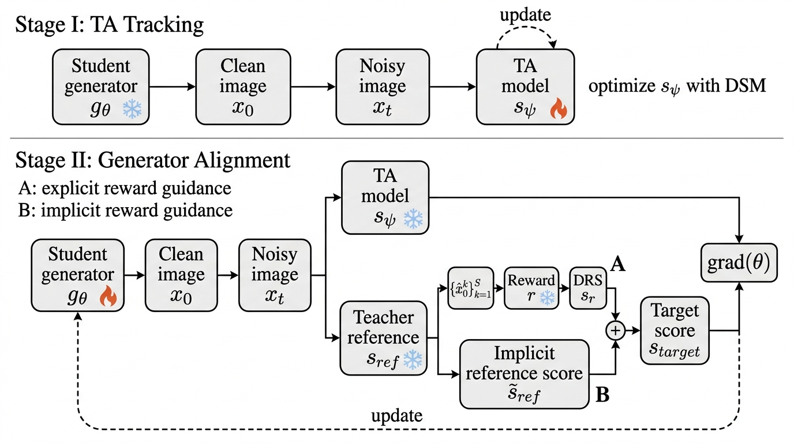
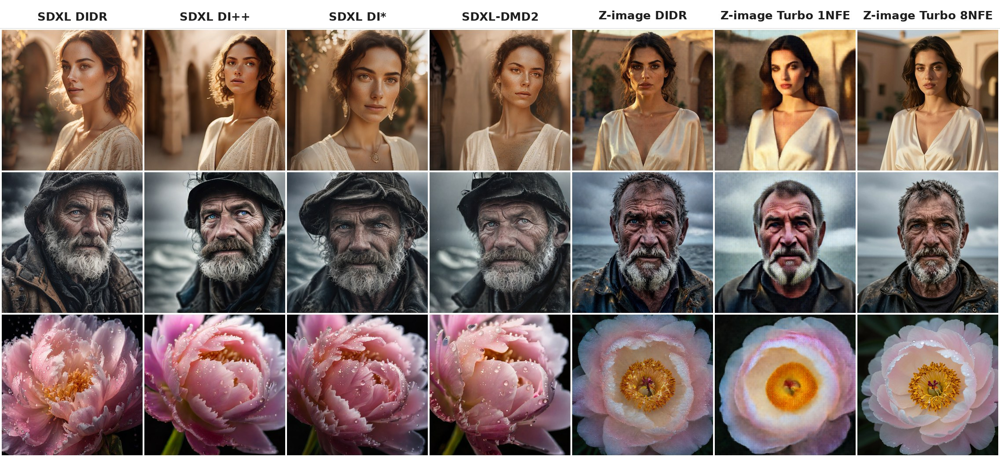

<div align="center">

# Diff-Instruct with Diffused Reward: Towards Principled One-step Generator RL

**NeurIPS 2026**

Junyi Wu<sup>1</sup>, Weijian Luo<sup>2</sup>, Haoyang Zheng<sup>1</sup>, Ruizhe Zhang<sup>1</sup>, Guang Lin<sup>1</sup>

<sup>1</sup>Purdue University &nbsp;&nbsp; <sup>2</sup>hi-lab, Xiaohongshu Inc.

[](https://arxiv.org/abs/2605.24001)
[](https://huggingface.co/Junyi-W/DIDR)


*1024×1024 images from one-step SDXL aligned via DIDR.*

</div>

## 📰 News

- **2026-10**: 🎉 DIDR is accepted to **NeurIPS 2026**!
- **2026-10**: Pretrained weights (1-step SDXL and 1-step Z-Image) released on [Hugging Face](https://huggingface.co/Junyi-W/DIDR).
- **2026-05**: Paper released on [arXiv](https://arxiv.org/abs/2605.24001).

## Abstract

Recent advances in one-step text-to-image generation have enabled real-time synthesis with remarkable efficiency and quality. Previous reinforcement learning methods for one-step generators combine reward optimization in image space with distribution matching in the diffusion noise space. This paradigm brings challenges due to a mismatch between terminal reward optimization and the underlying generative dynamics. As a result, optimization tends to exploit stochastic degrees of freedom, often improving reward at the expense of image fidelity. To address this issue, we propose **Diff-Instruct with Diffused Reward** (DIDR), a data-free trajectory-level alignment framework derived from Integral KL minimization. DIDR propagates the RLHF-optimal reward-tilted clean-image distribution across all noise levels along the diffusion trajectory. We show that this objective admits the same minimizer as clean-image RLHF, while naturally inducing **the Diffused Reward Score** (DRS), which acts as a reward-driven correction to the reference score function. To make this practical, we further introduce **the Diffused Reward Proxy** (DRP), an efficient estimator of DRS based on differentiable short-step denoising. Extensive experiments demonstrate that DIDR consistently Pareto-dominates existing one-step SDXL baselines. Moreover, when transferred to a 6B DiT backbone (Z-Image), DIDR surpasses its 50-step teacher in preference alignment with a single generation step and outperforms the 8-step Z-Image-Turbo with only 4 steps.

## Method

<div align="center">

</div>

**Stage I (TA):** $s_\psi$ tracks the generator marginals via DSM. **Stage II (Generator):** $g_\theta$ is updated toward the reward-tilted target score $\tilde{s}_{\mathrm{ref}} + s_r$.

## Qualitative Comparison

<div align="center">

</div>

One-step SDXL (DIDR, DI++, DI\*, DMD2) and Z-Image (DIDR vs. Z-Image-Turbo at 1 and 8 NFE) at 1024×1024.

## Model Zoo

| Model | Backbone | Steps | Download |
|---|---|---|---|
| SDXL DIDR | SDXL UNet (2.6B) | 1 | [`didr_sdxl_1step_unet_fp16.safetensors`](https://huggingface.co/Junyi-W/DIDR/blob/main/didr_sdxl_1step_unet_fp16.safetensors) |
| SDXL DIDR-longer | SDXL UNet (2.6B) | 1 | [`didr_longer_sdxl_1step_unet_fp16.safetensors`](https://huggingface.co/Junyi-W/DIDR/blob/main/didr_longer_sdxl_1step_unet_fp16.safetensors) |
| Z-Image DIDR | Z-Image DiT (6B) | 1 | [`zimage_transformer/`](https://huggingface.co/Junyi-W/DIDR/tree/main/zimage_transformer) |

## Quick Start

Install [diffusers](https://github.com/huggingface/diffusers) (`pip install -U diffusers transformers accelerate`), then:

#### 1-step Z-Image

```python
import torch
from diffusers import ZImagePipeline, ZImageTransformer2DModel

transformer = ZImageTransformer2DModel.from_pretrained("Junyi-W/DIDR", subfolder="zimage_transformer", torch_dtype=torch.bfloat16)
pipe = ZImagePipeline.from_pretrained("Tongyi-MAI/Z-Image-Turbo", transformer=transformer, torch_dtype=torch.bfloat16).to("cuda")
prompt = "A photorealistic portrait of a young woman in traditional Chinese red Hanfu, intricate golden embroidery, dramatic lighting, ultra high definition"
image = pipe(prompt=prompt, height=1024, width=1024, num_inference_steps=1, guidance_scale=0.0).images[0]
```

#### 1-step SDXL

```python
import torch
from diffusers import DiffusionPipeline, UNet2DConditionModel, LCMScheduler
from huggingface_hub import hf_hub_download
from safetensors.torch import load_file

base_model_id = "stabilityai/stable-diffusion-xl-base-1.0"
ckpt_name = "didr_sdxl_1step_unet_fp16.safetensors"  # or "didr_longer_sdxl_1step_unet_fp16.safetensors"
unet = UNet2DConditionModel.from_config(UNet2DConditionModel.load_config(base_model_id, subfolder="unet")).to("cuda", torch.float16)
unet.load_state_dict(load_file(hf_hub_download("Junyi-W/DIDR", ckpt_name), device="cuda"))
pipe = DiffusionPipeline.from_pretrained(base_model_id, unet=unet, torch_dtype=torch.float16, variant="fp16").to("cuda")
pipe.scheduler = LCMScheduler.from_config(pipe.scheduler.config)
image = pipe(prompt="a photo of a cat", num_inference_steps=1, guidance_scale=0, timesteps=[399]).images[0]
```

See the [model card](https://huggingface.co/Junyi-W/DIDR) for more details.

## Citation

```bib
@inproceedings{wu2026didr,
    title={Diff-Instruct with Diffused Reward: Towards Principled One-step Generator RL},
    author={Wu, Junyi and Luo, Weijian and Zheng, Haoyang and Zhang, Ruizhe and Lin, Guang},
    booktitle={Advances in Neural Information Processing Systems (NeurIPS)},
    year={2026}
}
```

## Acknowledgements

Our SDXL generators are initialized from [DMD2](https://github.com/tianweiy/DMD2) and our Z-Image generator from [Z-Image-Turbo](https://github.com/Tongyi-MAI/Z-Image). Inference is built on [🤗 diffusers](https://github.com/huggingface/diffusers). We thank the authors for releasing their work.

## Contact

Junyi Wu [wu2393@purdue.edu](mailto:wu2393@purdue.edu)

## License

The model weights are released under [CC BY-NC 4.0](https://creativecommons.org/licenses/by-nc/4.0/).
